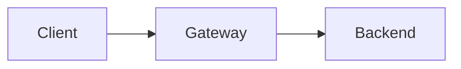

## Documentation Automation

### Changelog

Changelog is generated from git commit history using conventional commits.

**Automatic Updates:**

- Weekly via GitHub Action
- Includes commit links
- Groups by change type (Added, Fixed, Changed, etc.)

**Manual Update:**

```bash
make changelog
```

**Conventional Commit Format:**

```
feat: add new feature
fix: fix bug
docs: update documentation
refactor: refactor code
test: add tests
```

**Commit Types Mapping:**

- `feat:` → Added
- `fix:` → Fixed
- `docs:`, `refactor:`, `perf:`, `test:`, `build:`, `ci:`, `chore:` → Changed

### API Documentation

Generate API documentation from Python docstrings:

```bash
make api-docs
```

Requires Sphinx:

```bash
pip install sphinx sphinx-rtd-theme
```

## Development Workflows

### Pre-commit Hooks

The project uses 29 pre-commit hooks covering formatting, linting, security, and file hygiene. Run all hooks manually
with:

```bash
pre-commit run --all-files
```

To bypass (not recommended):

```bash
git commit --no-verify
```

### Testing Strategy

**Primary test command (pytest, 480 tests):**

```bash
python3 -m pytest tests/ -v
```

**Makefile shortcuts** (still available for targeted testing):

```bash
make test-auth         # Auth tests only
make test-health       # Health endpoint tests
make test-integration  # Full workflow
make test-docker       # Docker integration
make test              # Runs all available tests
```

### Makefile Commands

See all available commands:

```bash
make help
```

Key commands:

- `make setup` - One-time dev setup
- `make docs` - Update all documentation
- `make check` - Run pre-commit checks
- `make test` - Run test suite
- `make build` - Build Docker image
- `make diagnostics` - Collect system diagnostics

## Release Process

### Creating a Release

1. **Update version** (if needed in files)

1. **Tag the release:**

```bash
git tag -a v1.0.0 -m "Release v1.0.0"
git push origin v1.0.0
```

3. **Automated steps** (via GitHub Action):
   - Generates release changelog
   - Builds Docker image
   - Pushes to ghcr.io with version tags
   - Creates GitHub Release

### Version Tags

Use semantic versioning:

- `v1.0.0` - Major release
- `v1.1.0` - Minor release
- `v1.1.1` - Patch release

Docker images are tagged:

- `v1.0.0` - Specific version
- `1.0` - Major.minor
- `1` - Major
- `latest` - Latest release

## Documentation Guidelines

### Updating Documentation

**Architecture changes:** Edit `docs/ARCHITECTURE.md` with Mermaid diagrams.

**Script documentation:** Update `scripts/README.md` when adding/changing scripts.

**Configuration changes:** Update `docs/CONFIGURATION.md` with new env vars.

### Mermaid Diagrams

Use Mermaid for architecture diagrams:



Renders correctly in GitHub and most markdown viewers.

## Environment Variables

### Adding New Variables

1. **Add to start.sh:**

```bash
NEW_VAR="${NEW_VAR:-default_value}"
```

2. **Document in .env.example:**

```bash
# Description of NEW_VAR
NEW_VAR=default_value
```

3. **Document in docs/CONFIGURATION.md:** Add to appropriate table with description.

1. **Verify:** Run `pre-commit run --all-files` to check for issues.

## Troubleshooting Development

### Pre-commit Failing

**Format issues:**

```bash
make format  # Auto-format code
make check   # Verify all checks pass
```

### Tests Failing

**Collect diagnostics:**

```bash
make diagnostics
# Review /tmp/llama-diagnostics-*/SUMMARY.txt
```

**Enable verbose mode:**

```bash
VERBOSE=true bash scripts/tests/test_auth.sh
```

### Docker Issues

**Build failures:** Check build logs and ensure all files are present.

**Container won't start:**

```bash
docker logs <container-id>
```

**Permission errors:**

```bash
chmod +x scripts/**/*.sh
```
