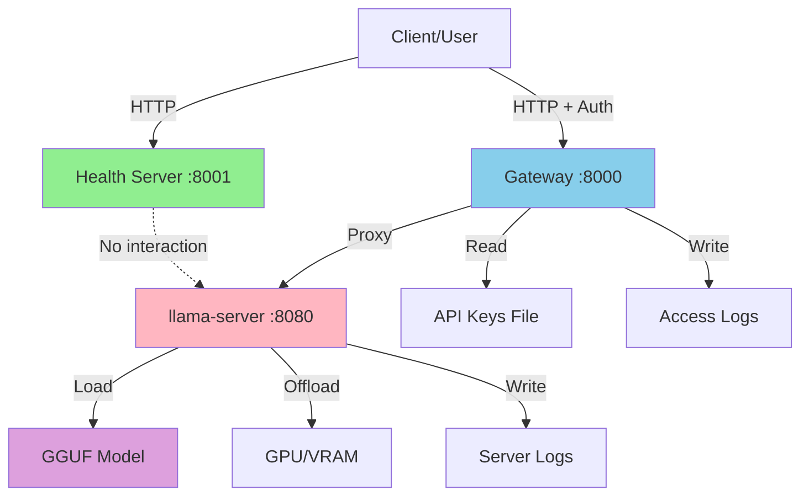
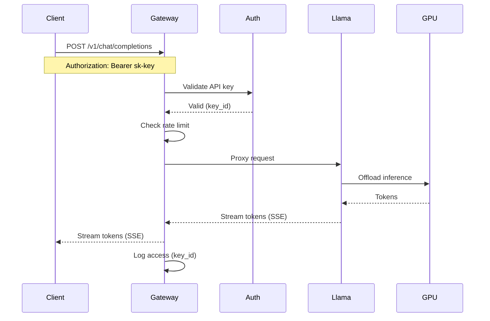
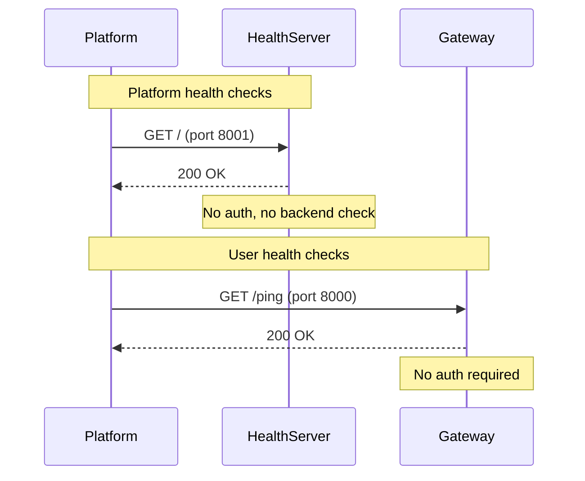
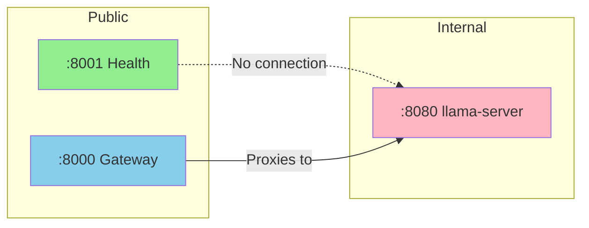
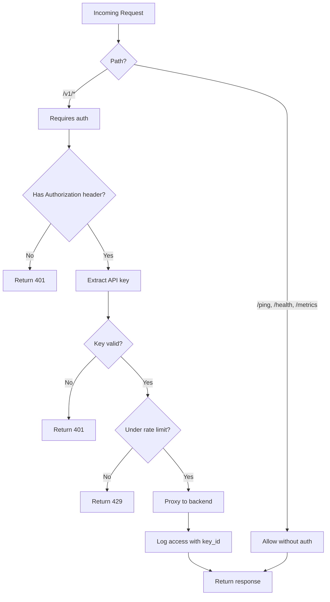
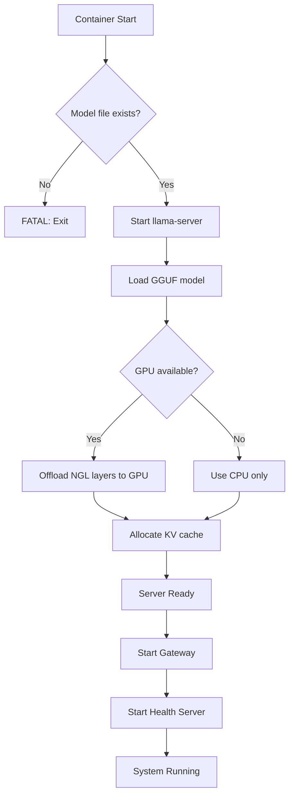
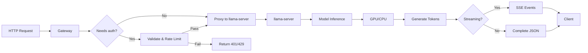
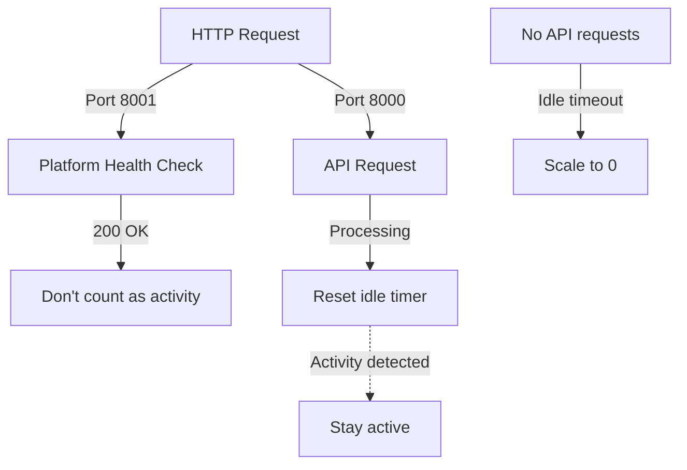
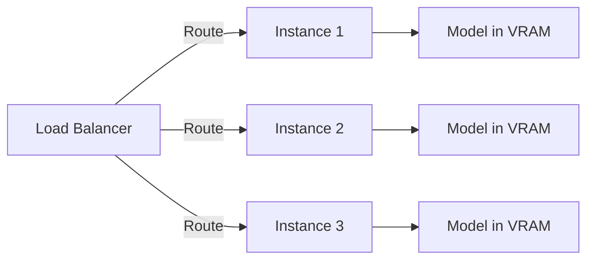

# Architecture

System architecture and design documentation for llama-gguf-inference.

## Table of Contents

- [Overview](#overview)
- [System Architecture](#system-architecture)
- [Request Flow](#request-flow)
- [Port Configuration](#port-configuration)
- [Authentication Flow](#authentication-flow)
- [Component Details](#component-details)
- [Data Flow](#data-flow)
- [Deployment Patterns](#deployment-patterns)
- [Performance Considerations](#performance-considerations)
- [Security](#security)

## Overview

llama-gguf-inference is a production-ready inference server for GGUF models using llama.cpp. It provides:

- **OpenAI-compatible API** - Drop-in replacement for OpenAI endpoints
- **Authentication** - API key-based access control
- **Health monitoring** - Separate health check port for platform integration
- **Streaming support** - Real-time token streaming via SSE
- **Platform agnostic** - Runs on any GPU cloud or local machine

## System Architecture



### Components

1. **Health Server** (port 8001)
   - Minimal HTTP server for platform health checks
   - No authentication required
   - No backend interaction
   - Enables scale-to-zero in serverless

2. **Gateway** (port 8000)
   - Python async HTTP gateway
   - API key authentication
   - Request proxying to llama-server
   - SSE streaming support
   - Public-facing interface

3. **llama-server** (port 8080)
   - Official llama.cpp HTTP server
   - Model inference engine
   - OpenAI-compatible API
   - Internal-only access

4. **Data Storage**
   - Models: `/data/models/*.gguf`
   - Logs: `/data/logs/`
   - API keys: `/data/api_keys.txt`

## Request Flow

### Standard API Request



### Health Check Request



## Port Configuration



### Port Purposes

| Port | Service | Public | Auth | Purpose |
|------|---------|--------|------|---------|
| 8001 | Health Server | ✅ | ❌ | Platform health checks (scale-to-zero) |
| 8000 | Gateway | ✅ | ✅* | API endpoints |
| 8080 | llama-server | ❌ | N/A | Internal inference engine |

*Auth required for `/v1/*` endpoints, not for `/ping`, `/health`, `/metrics`

## Authentication Flow



### API Key Format

```
File: /data/api_keys.txt
Format: key_id:api_key

Example:
production:sk-prod-abc123def456
alice-laptop:sk-alice-xyz789
```

## Component Details

### Gateway (scripts/gateway.py)

**Responsibilities:**
- API key validation
- Rate limiting (per key_id)
- Request proxying
- SSE streaming
- Access logging

**Technology:**
- Python 3.11+
- asyncio (async HTTP)
- No external dependencies (stdlib only)

**Key Features:**
- Handles streaming correctly (SSE)
- Non-blocking I/O
- Graceful shutdown (SIGTERM)
- Health endpoints exempt from auth

### Auth Module (scripts/auth.py)

**Responsibilities:**
- Load API keys from file
- Validate incoming keys
- Rate limit enforcement
- Access logging

**Data Structures:**
```python
# In-memory storage
keys = {
    "sk-prod-abc123": "production",  # api_key -> key_id
    "sk-alice-xyz789": "alice-laptop"
}

rate_limiter = {
    "production": [timestamp1, timestamp2, ...],  # key_id -> timestamps
    "alice-laptop": [timestamp3, ...]
}
```

### Health Server (scripts/health_server.py)

**Responsibilities:**
- Respond to platform health checks
- Minimal overhead
- No backend interaction

**Why Separate Port?**
- Platform health checks don't count as "activity"
- Enables proper scale-to-zero
- Avoids false positive "active" state

### llama-server (Binary)

**From:** llama.cpp project (ghcr.io/ggml-org/llama.cpp:server-cuda)

**Responsibilities:**
- Load GGUF model
- GPU offloading (NGL layers)
- Token generation
- OpenAI-compatible API

**Configuration:**
```bash
/app/llama-server \
  -m /data/models/model.gguf \
  --host 0.0.0.0 \
  --port 8080 \
  -c 16384 \
  -ngl 99
```

## Data Flow

### Model Loading



### Request Processing



### Logging

```mermaid
graph TD
    Boot[Container Boot] -->|Logs to| BootLog[/data/logs/_boot/YYYYMMDD_HHMMSS_boot_host.log]

    LlamaServer[llama-server] -->|Logs to| ServerLog[/data/logs/llama-TYPE/YYYYMMDD_HHMMSS_server_host.log]

    Gateway[Gateway Auth] -->|Logs to| AccessLog[/data/logs/api_access.log]

    BootLog -.->|Symlink| BootLatest[/data/logs/_boot/latest.txt]
    ServerLog -.->|Symlink| ServerLatest[/data/logs/llama-TYPE/latest.txt]

    style BootLog fill:#FFE4B5
    style ServerLog fill:#FFE4B5
    style AccessLog fill:#FFE4B5
```

**Log Organization:**
```
/data/logs/
├── _boot/
│   ├── 20240207_143022_boot_hostname.log    # Most recent
│   ├── 20240206_120000_boot_hostname.log
│   └── latest.txt -> 20240207_143022_boot_hostname.log
└── llama-{WORKER_TYPE}/
    ├── 20240207_143022_server_hostname.log  # Most recent
    ├── 20240206_120000_server_hostname.log
    └── latest.txt -> 20240207_143022_server_hostname.log
```

## Deployment Patterns

### Serverless (RunPod)



### Traditional Deployment



## Performance Considerations

### Memory Usage

```
Total VRAM = Model Size + KV Cache + Compute Buffer

Example (7B Q4 model, 16K context):
- Model: ~4 GB
- KV Cache: ~512 MB (per 8K context)
- Compute: ~500 MB
- Total: ~5 GB
```

### Throughput

**Factors:**
- GPU memory bandwidth
- Context length
- Batch size (handled by llama-server)
- Model quantization level

**Typical Performance (RTX 4090):**
- 7B Q4: ~100 tokens/sec
- 13B Q4: ~50 tokens/sec
- 30B Q4: ~25 tokens/sec

### Latency

**Time to first token:**
- Prompt processing: ~100-500ms (depends on prompt length)
- Network overhead: ~10-50ms
- Authentication: ~1ms

**Token generation:**
- 7B: ~10ms/token
- 13B: ~20ms/token
- 30B: ~40ms/token

## Security

### Threat Model

**Protected Against:**
- ✅ Unauthorized API access (API keys)
- ✅ Rate limit abuse (per-key limits)
- ✅ Credential leakage (keys in separate file)
- ✅ Platform coupling (health port separation)

**Not Protected Against:**
- ❌ DDoS (use external rate limiting/WAF)
- ❌ Prompt injection (application-level concern)
- ❌ Model extraction (inherent to API access)

### Best Practices

1. **API Keys:**
   - Generate with `openssl rand -hex 32`
   - Store in `chmod 600` file
   - Rotate regularly

2. **Network:**
   - Use reverse proxy (nginx/traefik)
   - Add TLS termination
   - Additional rate limiting at edge

3. **Monitoring:**
   - Check `/data/logs/api_access.log`
   - Monitor rate limit metrics
   - Alert on unusual patterns

---

*This document is auto-generated. For updates, modify the source and regenerate.*
