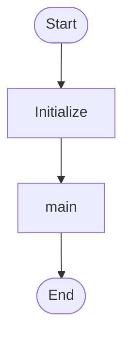
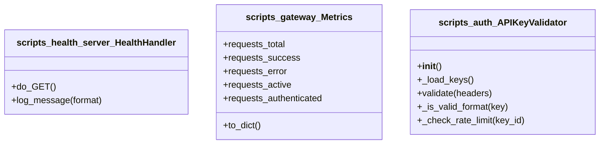
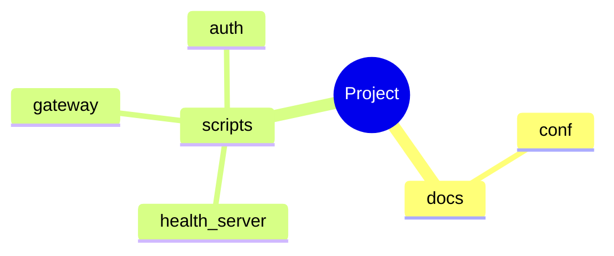
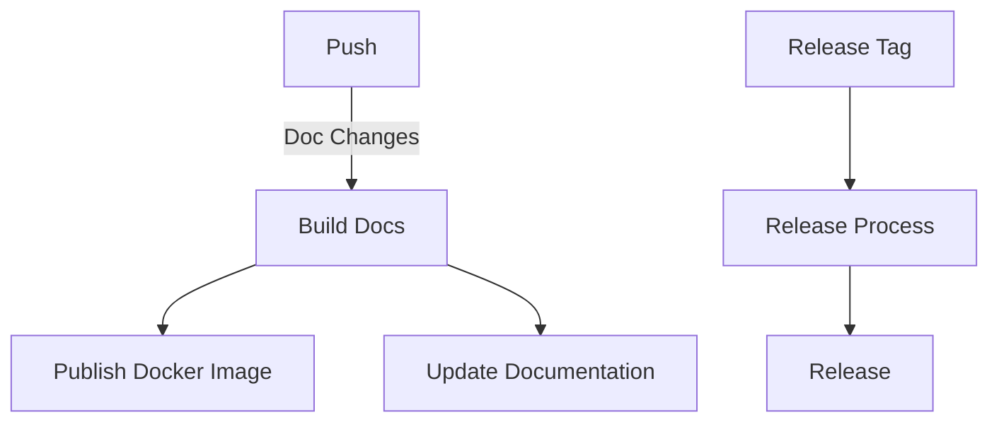
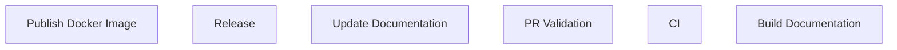
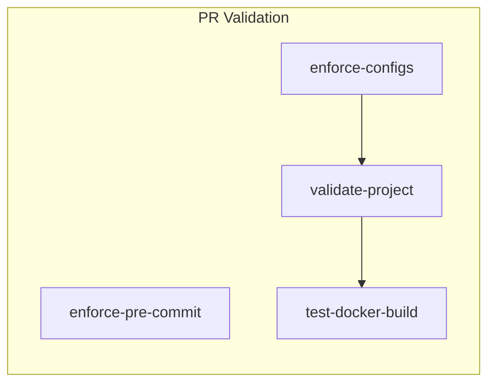

# Architecture (Auto-Generated)

**Generated:** 2026-02-09 20:44:31
**Project:** /home/zepfu/projects/llama-gguf-inference

## Overview

Analyzed **4** Python modules containing:
- **3** classes
- **14** functions
- **0** async functions

### Detected Patterns

- ❌ **Api**
- ❌ **Async**
- ❌ **Cli**
- ❌ **Database**
- ❌ **Dataclass**
- ❌ **Orm**
- ✅ **Server**
- ❌ **State Machine**
- ✅ **Workflows**

## Flowchart Diagram

## State Diagram

*State diagram not applicable for this codebase.*

## Sequence Diagram

*Sequence diagram not applicable for this codebase.*

## Architecture Diagram

## Er Diagram

*Er diagram not applicable for this codebase.*

## Class Diagram

## Journey Diagram

*Journey diagram not applicable for this codebase.*

## Mindmap Diagram

## Workflow Pipeline Diagram

## Workflow Triggers Diagram

## Workflow Jobs Diagram

## Development Workflows

### GitHub Workflows Summary

| Workflow | Triggers | Jobs |
|----------|----------|------|
| Build Documentation |  | check-ci-status, build-docs, validate-rtd |
| CI |  | config-validation, python-standards, shell-standards... |
| PR Validation |  | enforce-pre-commit, enforce-configs, validate-project... |
| Publish Docker Image |  | check-ci-success, publish |
| Release |  | release |
| Update Documentation |  | update-docs |

## Module Summary

### `docs.conf`

- **Classes:** 0
- **Functions:** 0
- **Async Functions:** 0

### `scripts.auth`

auth.py - API Key Authentication Module for Gateway

File-based authentication system that enforces API keys while maintaining
OpenAI compatibility. Uses key_id:api_key format for easy management and ...

- **Classes:** 1
- **Functions:** 7
- **Async Functions:** 0

### `scripts.gateway`

gateway.py – Async HTTP gateway for llama.cpp llama-server

Features:
- API key authentication with health endpoint exemption
- Proper SSE/streaming support for chat completions
- /ping and /health en...

- **Classes:** 1
- **Functions:** 4
- **Async Functions:** 0

### `scripts.health_server`

health_server.py — Ultra-lightweight health check server for RunPod

This server runs on PORT_HEALTH (separate from the main gateway) and provides
a minimal health check endpoint that doesn't interact...

- **Classes:** 1
- **Functions:** 3
- **Async Functions:** 0

---

*Generated by: `generate_architecture.py` from repo-standards*
