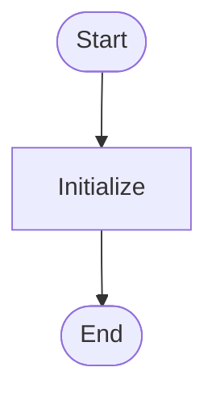
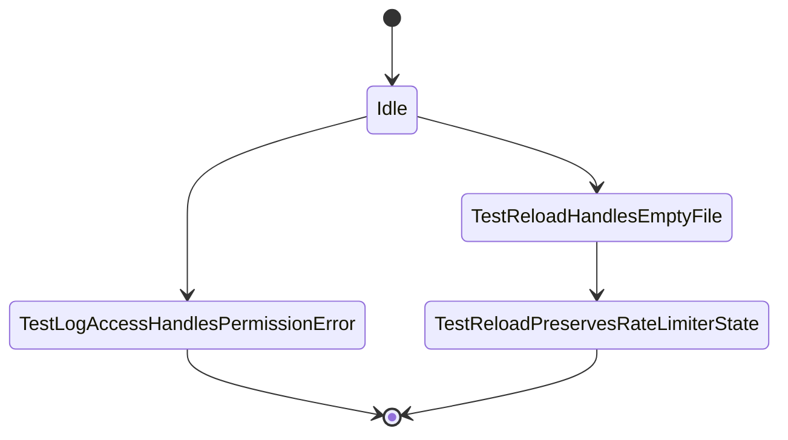
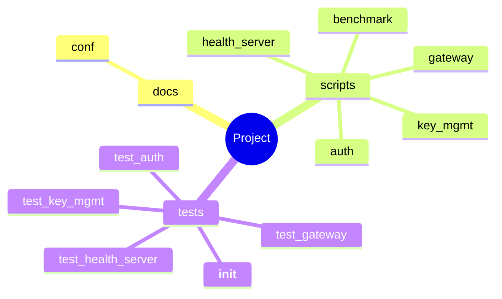
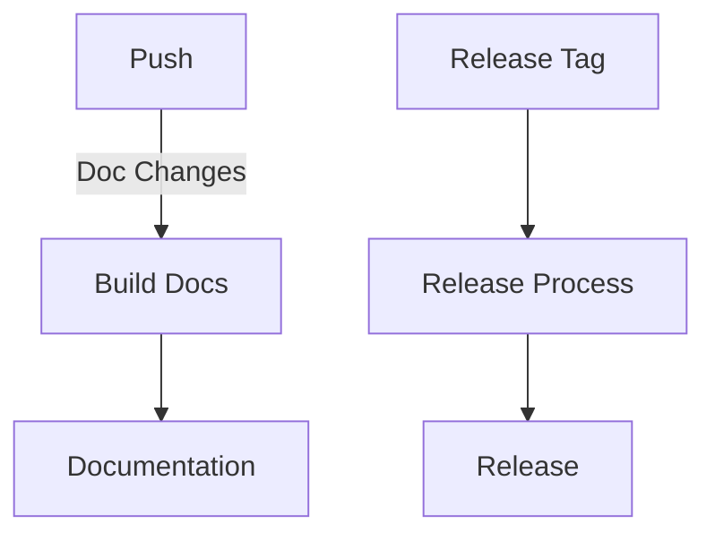
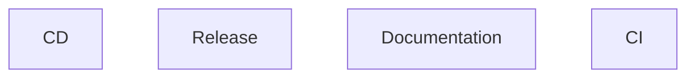
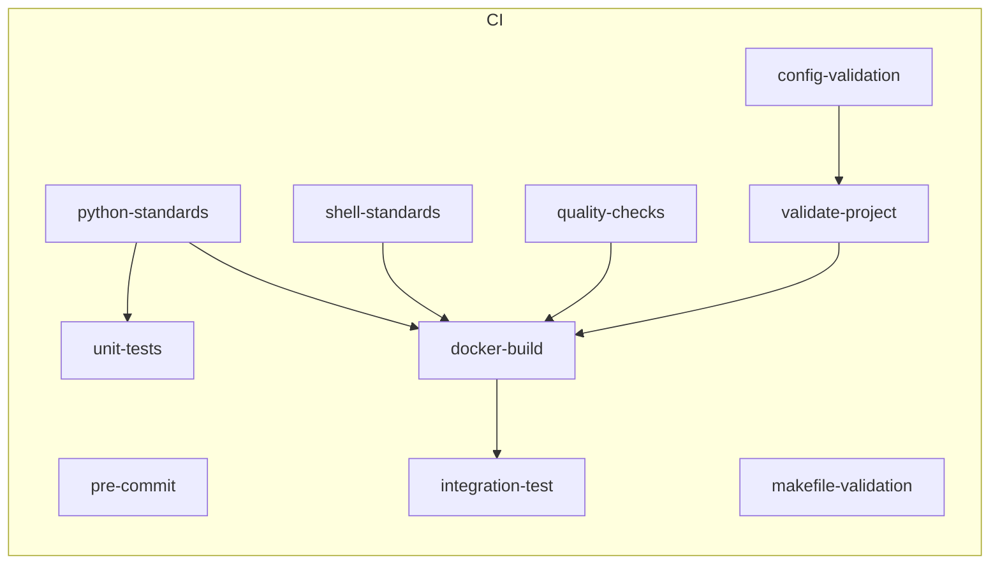

# Architecture (Auto-Generated)

**Generated:** 2026-07-13 10:10:38 **Project:** /home/runner/work/llama-gguf-inference/llama-gguf-inference

## Overview

Analyzed **13** Python modules containing:

- **138** classes
- **713** functions
- **0** async functions

### Detected Patterns

- ❌ **Api**
- ❌ **Async**
- ✅ **Cli**
- ❌ **Database**
- ❌ **Dataclass**
- ❌ **Orm**
- ✅ **Server**
- ✅ **State Machine**
- ✅ **Workflows**

## Flowchart Diagram

```mermaid
flowchart TD
    Start([Start]) --> Init[Initialize]
    Init --> End([End])
```

## State Diagram

```mermaid
stateDiagram-v2
    [*] --> Idle
    Idle --> TestLogAccessHandlesPermissionError
    TestLogAccessHandlesPermissionError --> [*]
    Idle --> TestReloadHandlesEmptyFile
    TestReloadHandlesEmptyFile --> TestReloadPreservesRateLimiterState
    TestReloadPreservesRateLimiterState --> [*]
```

## Sequence Diagram

*Sequence diagram not applicable for this codebase.*

## Architecture Diagram

```mermaid
architecture-beta
    group scripts(cloud)[Scripts]
        service scripts_gateway(server)[gateway] in scripts
        service scripts_key_mgmt(server)[key_mgmt] in scripts
        service scripts_benchmark(server)[benchmark] in scripts
    end
    group docs(cloud)[Docs]
        service docs_conf(server)[conf] in docs
    end
    group tests(cloud)[Tests]
        service tests___init__(server)[__init__] in tests
        service tests_test_key_mgmt(server)[test_key_mgmt] in tests
        service tests_test_auth(server)[test_auth] in tests
    end
```

## Er Diagram

*Er diagram not applicable for this codebase.*

## Class Diagram

```mermaid
classDiagram
    class scripts_gateway_Metrics {
        +requests_total
        +requests_success
        +requests_error
        +requests_active
        +requests_authenticated
        +to_dict()
        +to_prometheus()
    }
    class scripts_auth_APIKeyValidator {
        +__init__()
        +_load_keys()
        +_parse_key_metadata()
        +validate(headers)
        +_is_key_expired(key_id)
    }
    class scripts_health_server_HealthHandler {
        +do_GET()
        +log_message(format)
    }
    class tests_test_key_mgmt_TestValidateKeyId {
        +test_valid_alphanumeric()
        +test_valid_with_hyphens()
        +test_valid_with_underscores()
        +test_valid_mixed()
        +test_valid_single_char()
    }
    class tests_test_key_mgmt_TestGenerateApiKey {
        +test_starts_with_prefix()
        +test_correct_length()
        +test_unique_keys()
        +test_valid_characters()
    }
    class tests_test_key_mgmt_TestGenerate {
        +test_generate_creates_key(tmp_path)
        +test_generate_duplicate_name_fails(keys_file)
        +test_generate_invalid_name_fails(tmp_path)
        +test_generate_quiet_mode(tmp_path, capsys)
        +test_generate_preserves_comments(keys_file)
    }
    class tests_test_key_mgmt_TestList {
        +test_list_empty_file(empty_keys_file, capsys)
        +test_list_with_keys(keys_file, capsys)
        +test_list_never_shows_key_values(keys_file, capsys)
        +test_list_missing_file(tmp_path, capsys)
    }
    class tests_test_key_mgmt_TestRemove {
        +test_remove_existing_key(keys_file)
        +test_remove_nonexistent_fails(keys_file)
        +test_remove_preserves_comments(keys_file)
        +test_remove_missing_file_fails(tmp_path)
    }
    class tests_test_key_mgmt_TestRotate {
        +test_rotate_existing_key(keys_file)
        +test_rotate_nonexistent_fails(keys_file)
        +test_rotate_quiet_mode(keys_file, capsys)
        +test_rotate_preserves_other_keys(keys_file)
        +test_rotate_missing_file_fails(tmp_path)
    }
    class tests_test_key_mgmt_TestFilePermissions {
        +test_file_permissions_after_generate(tmp_path)
        +test_file_permissions_after_remove(keys_file)
        +test_file_permissions_after_rotate(keys_file)
    }
    class tests_test_key_mgmt_TestAtomicWrite {
        +test_atomic_write_creates_file(tmp_path)
        +test_atomic_write_replaces_file(tmp_path)
        +test_atomic_write_no_temp_files_left(tmp_path)
        +test_atomic_write_permissions(tmp_path)
        +test_atomic_write_creates_parent_dirs(tmp_path)
    }
    class tests_test_key_mgmt_TestCLIIntegration {
        +test_cli_generate_and_list(tmp_path)
        +test_cli_quiet_generate(tmp_path)
        +test_cli_no_command_shows_help()
        +test_cli_remove_and_verify(tmp_path)
        +test_cli_rotate_and_verify(tmp_path)
    }
    class tests_test_key_mgmt_TestGetDefaultKeysFile {
        +test_auth_keys_file_env(monkeypatch)
        +test_data_dir_env(monkeypatch)
        +test_default_path(monkeypatch)
    }
    class tests_test_key_mgmt_TestLoadKeysFileEdgeCases {
        +test_nonexistent_file(tmp_path)
        +test_lines_without_colon(tmp_path)
        +test_comment_lines(tmp_path)
        +test_blank_lines(tmp_path)
    }
    class tests_test_key_mgmt_TestAtomicWriteFailure {
        +test_atomic_write_cleanup_on_failure(tmp_path)
    }
```

## Journey Diagram

*Journey diagram not applicable for this codebase.*

## Mindmap Diagram

```mermaid
mindmap
  root((Project))
    docs
      conf
    scripts
      gateway
      key_mgmt
      benchmark
      auth
      health_server
    tests
      __init__
      test_key_mgmt
      test_auth
      test_health_server
      test_gateway
```

## Workflow Pipeline Diagram

```mermaid
flowchart TD

    Push -->|Doc Changes| Docs[Build Docs]
    Docs --> docs[Documentation]

    Tag[Release Tag] --> Release[Release Process]
    Release --> release[Release]
```

## Workflow Triggers Diagram

```mermaid
graph TD
    cd[CD]
    release[Release]
    docs[Documentation]
    ci[CI]
```

## Workflow Jobs Diagram

```mermaid
flowchart LR
    subgraph ci[CI]
        pre_commit[pre-commit]
        python_standards[python-standards]
        shell_standards[shell-standards]
        quality_checks[quality-checks]
        config_validation[config-validation]
        makefile_validation[makefile-validation]
        unit_tests[unit-tests]
        validate_project[validate-project]
        docker_build[docker-build]
        integration_test[integration-test]
        python_standards --> unit_tests
        config_validation --> validate_project
        python_standards --> docker_build
        shell_standards --> docker_build
        quality_checks --> docker_build
        validate_project --> docker_build
        docker_build --> integration_test
    end
```

## Development Workflows

### GitHub Workflows Summary

| Workflow      | Triggers | Jobs                                             |
| ------------- | -------- | ------------------------------------------------ |
| CD            |          | publish-cuda, publish-cpu                        |
| CI            |          | pre-commit, python-standards, shell-standards... |
| Documentation |          | build-docs, validate-rtd, update-docs            |
| Release       |          | prepare, release-cuda, release-cpu...            |

## Module Summary

### `docs.conf`

- **Classes:** 0
- **Functions:** 0
- **Async Functions:** 0

### `scripts.auth`

auth.py - API Key Authentication Module for Gateway

File-based authentication system that enforces API keys while maintaining OpenAI compatibility. Uses key_id:api_key
format for easy management and ...

- **Classes:** 1
- **Functions:** 13
- **Async Functions:** 0

### `scripts.benchmark`

benchmark.py -- Performance benchmarking for llama-gguf-inference gateway.

Measures two categories of performance:

1. Gateway overhead (proxy latency)
   - /ping latency (gateway-only, no backend in...

- **Classes:** 0
- **Functions:** 11
- **Async Functions:** 0

### `scripts.gateway`

gateway.py – Async HTTP gateway for llama.cpp llama-server

Features:

- API key authentication with health endpoint exemption

- Proper SSE/streaming support for chat completions

- /ping and /health en...

- **Classes:** 1

- **Functions:** 11

- **Async Functions:** 0

### `scripts.health_server`

health_server.py — Ultra-lightweight health check server for RunPod

This server runs on PORT_HEALTH (separate from the main gateway) and provides a minimal health check endpoint that
doesn't interact...

- **Classes:** 1
- **Functions:** 3
- **Async Functions:** 0

### `scripts.key_mgmt`

key_mgmt.py - API Key Management CLI for llama-gguf-inference

Standalone CLI tool for managing API keys used by the gateway's authentication system. Keys are stored in a flat file
with the format: ...

- **Classes:** 0
- **Functions:** 16
- **Async Functions:** 0

### `tests.__init__`

- **Classes:** 0
- **Functions:** 0
- **Async Functions:** 0

### `tests.conftest`

Shared test fixtures for auth module tests.

- **Classes:** 0
- **Functions:** 4
- **Async Functions:** 0

### `tests.test_auth`

Unit tests for scripts/auth.py - API Key Authentication Module.

- **Classes:** 28
- **Functions:** 117
- **Async Functions:** 0

### `tests.test_benchmark`

Unit tests for scripts/benchmark.py -- Benchmark module.

- **Classes:** 19
- **Functions:** 50
- **Async Functions:** 0

### `tests.test_gateway`

Unit tests for scripts/gateway.py - Gateway module (CORS, Prometheus metrics, queue).

- **Classes:** 161
- **Functions:** 357
- **Async Functions:** 0

### `tests.test_health_server`

Unit tests for scripts/health_server.py -- Health check server.

- **Classes:** 3
- **Functions:** 11
- **Async Functions:** 0

### `tests.test_key_mgmt`

Unit tests for scripts/key_mgmt.py - API Key Management CLI.

- **Classes:** 29
- **Functions:** 120
- **Async Functions:** 0

______________________________________________________________________

*Generated by: `generate_architecture.py` from repo-standards*
